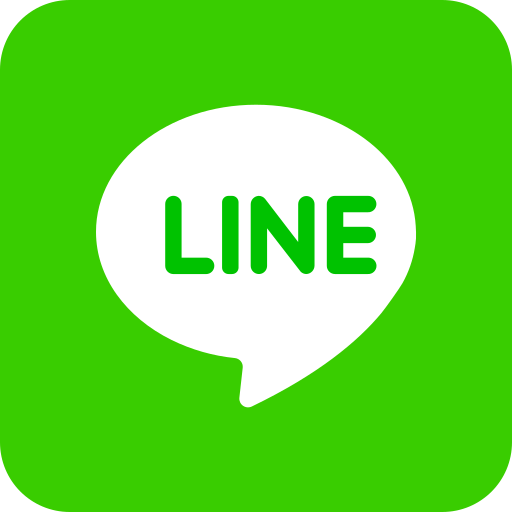

# 🤖 line-nodejs

 **Modern LINE bot framework for Node.js with clean API and working E2EE support**


[](https://nodejs.org/)
[](https://opensource.org/licenses/MIT)

## ✨ Features

- 🎯 **Clean API** - Simple and intuitive bot development experience
- 🔐 **Working E2EE** - Full End-to-End Encryption support with automatic decryption
- 📦 **Modular Architecture** - Well-organized codebase with clear separation of concerns
- 🚀 **Modern ES6+** - Uses latest JavaScript features (import/export, async/await, classes)
- 💾 **Smart Storage** - Automatic data management and persistence
- ⚡ **High Performance** - Efficient polling and connection management
- 🛡️ **Robust Error Handling** - Comprehensive error management with graceful recovery
- 🔑 **QR Code Login** - Easy authentication with QR code generation
- 📱 **Multi-Device Support** - Works with different LINE client types
- 🧩 **Command System** - Built-in command handling with extensible architecture

## 🚀 Quick Start

### Installation

```bash
git clone https://github.com/CyberTKR/line-nodejs.git
cd line-nodejs
npm install
```

### Basic Bot Example

```javascript
import { Bot } from './src/core/Bot.js';

const bot = new Bot({
    device: "DESKTOPWIN",
    enableE2EE: true,
    logLevel: 'INFO'
});

// Handle text messages
bot.onText(async (message) => {
    const { text, to } = message;
    
    if (text === 'hi') {
        await bot.send(to, 'Hello! 👋');
    } else if (text === 'ping') {
        await bot.send(to, 'Pong! 🏓');
    }
});

// Handle group invitations
bot.onInvite(async (invite) => {
    await bot.acceptInvitation(invite.groupId);
    await bot.send(invite.groupId, '👋 Hello everyone!');
});

// Start the bot
await bot.start();
```

### Token-based Login

```javascript
import { Bot } from './src/core/Bot.js';

const bot = new Bot({
    token: 'your-auth-token-here',
    device: "DESKTOPWIN",
    enableE2EE: true
});

await bot.start();
```

## 📋 API Reference

### Bot Constructor

```javascript
const bot = new Bot({
    token: 'string',        // Optional: LINE auth token for direct login
    device: 'string',       // Device type (see supported devices below)
    enableE2EE: true,       // Enable E2EE message decryption
    language: 'en_EN',      // Language setting
    storage: './data',      // Storage directory path
    logLevel: 'INFO'        // Logging level (DEBUG, INFO, WARN, ERROR)
});
```

### Core Methods

```javascript
// Authentication & Control
await bot.start()                      // Start bot (shows QR if no token)
await bot.stop()                       // Stop bot gracefully
await bot.getProfile()                 // Get bot profile

// Messaging
await bot.send(to, message)            // Send text message to user or group

// Group Management  
await bot.acceptInvitation(groupId)    // Accept group invitation
await bot.deleteSelfFromChat(chatId)   // Leave group/chat
await bot.getChats(chatIds)           // Get chat information
await bot.getAllChatMids()            // Get all chat IDs
```

### Event Handlers

```javascript
// Message Events
bot.onText(handler)       // Handle text messages
bot.onMessage(handler)    // Handle all message types
bot.onRead(handler)       // Handle message read events

// System Events
bot.onReady(handler)      // Bot ready (after successful login)
bot.onInvite(handler)     // Group invitations
bot.onJoin(handler)       // User joined group
bot.onLeave(handler)      // User left group
bot.onError(handler)      // Error handling
```

### Message Object Structure

```javascript
{
    type: 'receive',           // 'send' or 'receive'
    from: 'u1234...',         // Sender ID
    to: 'u5678...',           // Recipient ID (user or group)
    id: 'msg_...',            // Unique message ID
    text: 'Hello',            // Message text content
    contentType: 0,           // Content type (0=text, 1=image, etc.)
    createdTime: 1234567890,  // Unix timestamp
    encrypted: false,         // Whether message was E2EE encrypted
    raw: {...}                // Raw operation data from LINE
}
```

## 🏗️ Architecture

### Project Structure

```
line-nodejs/
├── src/
│   ├── core/                 # Core bot system
│   │   └── Bot.js           # Main Bot class with clean API
│   ├── services/            # LINE protocol services
│   │   ├── client.js        # Base client connection
│   │   ├── e2ee.js         # E2EE encryption/decryption
│   │   ├── server.js       # Server communication
│   │   ├── thrift.js       # Thrift protocol handling
│   │   └── modules/        # Protocol modules
│   │       ├── talk.js     # Talk service (messaging)
│   │       ├── sync.js     # Sync service
│   │       └── qr_login.js # QR code authentication
│   ├── commands/           # Built-in commands
│   │   └── commands.js    # Command implementations
│   ├── storage/           # Data persistence
│   │   └── StorageManager.js
│   └── utils/             # Utilities
│       ├── Logger.js      # Logging system
│       ├── Config.js      # Configuration management
│       ├── QrCodeGenerator.js # QR code generation
│       └── Helpers.js     # Helper functions
├── examples/              # Example bots
│   ├── simple-bot.js     # Basic bot example
│   └── token-login.js    # Token-based login example
└── data/                 # Bot data storage (auto-created)
```

## 🔐 E2EE (End-to-End Encryption) Support

line-nodejs includes full E2EE support with automatic message decryption:

```javascript
bot.onText(async (message) => {
    // E2EE messages are automatically decrypted
    if (message.encrypted) {
        console.log('🔐 This was an encrypted message!');
    }
    
    // message.text contains the decrypted content
    console.log('Message:', message.text);
});
```

### E2EE Features

- ✅ **Automatic Decryption** - Encrypted messages are transparently decrypted
- ✅ **V1 & V2 Support** - Supports both E2EE protocol versions  
- ✅ **Key Management** - Automatic key generation, storage and retrieval
- ✅ **Error Recovery** - Graceful fallback for decryption failures
- ✅ **Performance Optimized** - Efficient encryption/decryption processing

## 📱 Supported Devices

line-nodejs supports multiple LINE client types:

- **DESKTOPWIN** - Windows desktop client (recommended)
- **IOS** - iOS mobile client
- **IOSIPAD** - iPad client  
- **CHROMEOS** - Chrome OS client

```javascript
const bot = new Bot({
    device: "DESKTOPWIN"  // Most stable option
});
```

## 🛠️ Built-in Commands

The framework includes a comprehensive command system:

| Command | Description | Usage |
|---------|-------------|-------|
| `hi` | Greet the bot | Send "hi" |
| `time` | Show current time | Send "time" |
| `gr` | Show chat information | Send "gr" |
| `tagall` | Tag all group members | Send "tagall" |
| `stats` | Show bot statistics | Send "stats" |
| `help` | Show available commands | Send "help" |
| `chats` | List all chat IDs | Send "chats" |
| `bye` | Leave current group | Send "bye" |
| `ping` | Ping/pong test | Send "ping" |
| `version` | Show bot version | Send "version" |
| `joke` | Tell a random joke | Send "joke" |

## 💾 Storage System

Automatic data persistence with simple API:

```javascript
// Data is automatically saved to ./data/ directory
// Storage is handled per-bot instance

// Bot data is automatically managed
// No manual storage configuration needed
```

## 🔧 Advanced Usage

### Custom Error Handling

```javascript
bot.onError((error) => {
    console.error('Bot error:', error.message);
    
    // Handle specific error types
    if (error.message.includes('AUTH_FAILED')) {
        // Handle authentication issues
        console.log('Please check your token or re-scan QR code');
    }
});
```

### QR Code Login

```javascript
// When no token is provided, bot will show QR code
const bot = new Bot({
    device: "DESKTOPWIN",
    enableE2EE: true
});

bot.onReady((profile) => {
    console.log(`✅ Logged in as: ${profile.displayName}`);
    console.log(`🔑 Auth Token: ${bot.client.authToken}`);
    // Save this token for future use
});

await bot.start(); // Will display QR code for scanning
```

### Group Auto-Management

```javascript
bot.onInvite(async (invite) => {
    const { groupId, inviter } = invite;
    
    // Auto-accept invitations
    await bot.acceptInvitation(groupId);
    
    // Send welcome message
    await bot.send(groupId, `👋 Hello! I was invited by ${inviter}`);
    
    // Get group info
    const groupInfo = await bot.getGroupInfo(groupId);
    console.log(`Joined group: ${groupInfo.name}`);
});
```

## 🐛 Troubleshooting

### Common Issues

**QR Code not appearing**
- Make sure you don't have a token set
- Check that your terminal supports image display
- Try running with `logLevel: 'DEBUG'`

**Messages not being received**
- Verify bot is properly started with `bot.onReady()`
- Check if E2EE is enabled for encrypted chats
- Ensure proper event handlers are registered

**E2EE decryption failing**
- Some bot accounts don't support E2EE
- This is normal behavior - bot will handle regular messages
- Enable debug logging to see encryption status

**Connection issues**
- Check your internet connection
- Verify LINE servers are accessible
- Try different device types if issues persist

### Debug Mode

Enable detailed logging for troubleshooting:

```javascript
const bot = new Bot({
    logLevel: 'DEBUG'  // Show all debug information
});
```

## 📈 Performance

- **Memory efficient** - Optimized for long-running bots
- **Fast startup** - Quick initialization and connection
- **Reliable polling** - Robust message polling with auto-recovery
- **Low latency** - Fast message processing and response times

## 🔄 Migration from Other Solutions

### From Custom LINE Implementations

line-nodejs provides a simpler, more intuitive API while maintaining full functionality:

```javascript
// Traditional LINE implementation
// Complex Thrift setup, manual E2EE handling, raw protocol management

// line-nodejs style  
const bot = new Bot({ token: '...' });
// Clean API with automatic E2EE, built-in commands, and modern async/await
```

### From Other Bot Frameworks

Easy migration with familiar event-driven architecture and clean async/await syntax.

## 📄 License

MIT License - see [LICENSE](LICENSE) file for details.

## 🤝 Contributing

Contributions are welcome! Please feel free to submit a Pull Request.

## 📞 Support

If you encounter any issues or have questions:

1. Check the [troubleshooting section](#-troubleshooting)
2. Enable debug mode for detailed logs
3. Open an issue on GitHub with error details
4. 📱 **Contact via LINE**:  [Add me on LINE](https://line.me/ti/p/KvDfdDCgAW)

---

**line-nodejs** - Modern LINE bot framework with clean API and working E2EE support 🚀